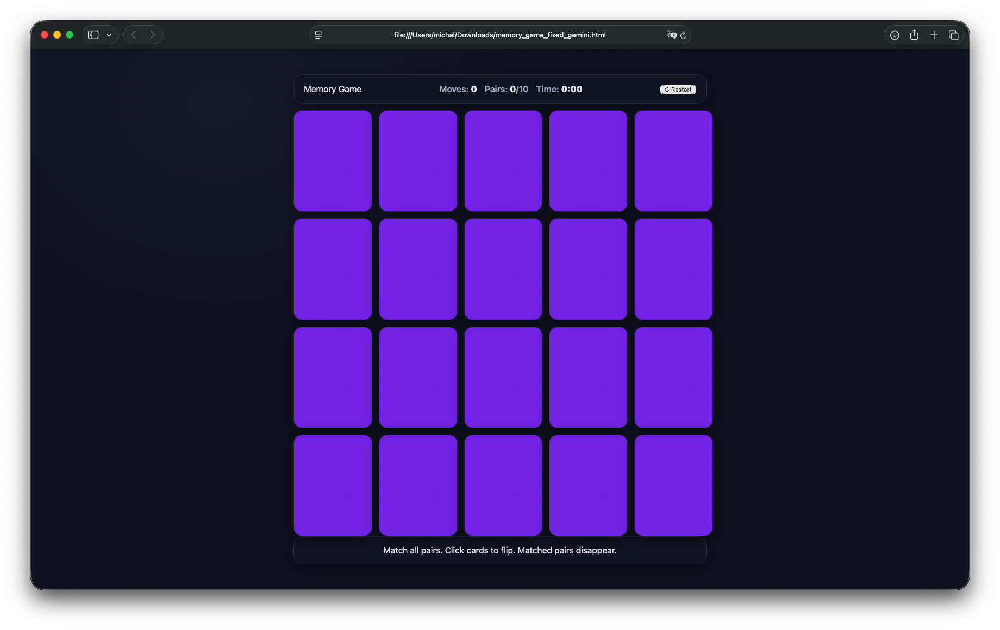

# 🧠 Memory Game (Vanilla JavaScript)

A simple, browser-based **memory matching game** built with **vanilla HTML, CSS, and JavaScript**.  
Flip cards to reveal emoji faces, match pairs to make them disappear, and try to clear the board in the fewest moves possible.

---

## 🧪 Full article

📖 This repository is part of my vibe-coding experiment, where I challenged ChatGPT, Claude, and Gemini to build a simple memory game. You can read the full write-up — including screenshots, code examples, and a detailed comparison — here:

👉 [https://michalcichon.github.io/programming/2025/10/01/game-vibecoded-in-chatgpt-gemini-and-claude.html](https://michalcichon.github.io/programming/2025/10/01/game-vibecoded-in-chatgpt-gemini-and-claude.html)

---

## ✨ Features

- 🃏 **20 cards (5×4 grid)** – each card hides an emoji face (fruits, vegetables, animals, symbols).
- 🎨 **Clean design** – solid purple backs, white emoji faces, smooth flip animations.
- 🔄 **Responsive layout** – works well on desktop and mobile browsers.
- 📊 **Live stats** – shows moves, matched pairs, and elapsed time.
- 🔁 **Restart button** – reshuffle the board anytime.
- ♿ **Accessible** – cards are keyboard-navigable and use ARIA roles.

---

## 📁 Project Structure

    memo-game/
    ├─ index.html       # Main HTML file (contains HTML, CSS, and JS)
    └─ docs/
       └─ screenshot.png # Optional screenshot for README

> 💡 In this version, all code is contained in a single `index.html` file — easy to host and share.

---

## 🚀 Getting Started

### 1. Clone the repository

    git clone https://github.com/michalcichon/memo-game.git
    cd memory-game

### 2. Open in your browser

Simply open `index.html` in any modern browser (Chrome, Firefox, Safari, Edge):

    open index.html

No build tools, no dependencies — **pure vanilla JS**.

---

## 🕹️ How to Play

1. Click a card to flip it and reveal the emoji.
2. Click a second card:
   - ✅ If they match → both disappear.
   - ❌ If they don’t → they flip back after a short delay.
3. Repeat until all **10 pairs** are matched.
4. Check your stats — **fewer moves and less time = better memory!**

---

## ⚙️ Customization

Want to modify the game? It’s easy:

- 🧩 **Grid size:** Adjust `grid-template-columns` and total card count to change difficulty.
- 🐱 **Emoji set:** Replace the emoji list in the script with your own.
- 🎨 **Theme:** Change colors and typography in the CSS variables section.

---

## 🧪 Browser Compatibility

Tested in:

- ✅ Chrome  
- ✅ Firefox  
- ✅ Safari  
- ✅ Edge

---

## 📜 License

This project is licensed under the [MIT License](LICENSE).

---

## 🧠 About This Project

This project was **vibe-coded with ChatGPT 5** — built collaboratively through iterative conversation and debugging, purely for fun and learning. 🎉

---

## 🧠 About the fix

The original implementation was created by ChatGPT and is fully functional, but it contained a few subtle issues — for example, inconsistent card flipping and minor visual glitches.  
The `claude-fix` version shows how Claude approached the same code and improved the final behavior, offering a more polished result with minimal changes.

---

## 💡 Contributing

Contributions are welcome!  
Fork the repo, make improvements (e.g., animations, levels, scoreboards), and open a pull request.

---

## 🔗 Related repositories

- 🧠 [memo-game](https://github.com/michalcichon/memo-game) – Original version generated by ChatGPT  
- 🤖 [memo-game-claude](https://github.com/michalcichon/memo-game-claude) – Version improved by Claude  
- 🪄 [memo-game-gemini](https://github.com/michalcichon/memo-game-gemini) – Version generated by Gemini

---

**Enjoy training your memory 🧠 and reflexes ⚡ with this lightweight web game!**
